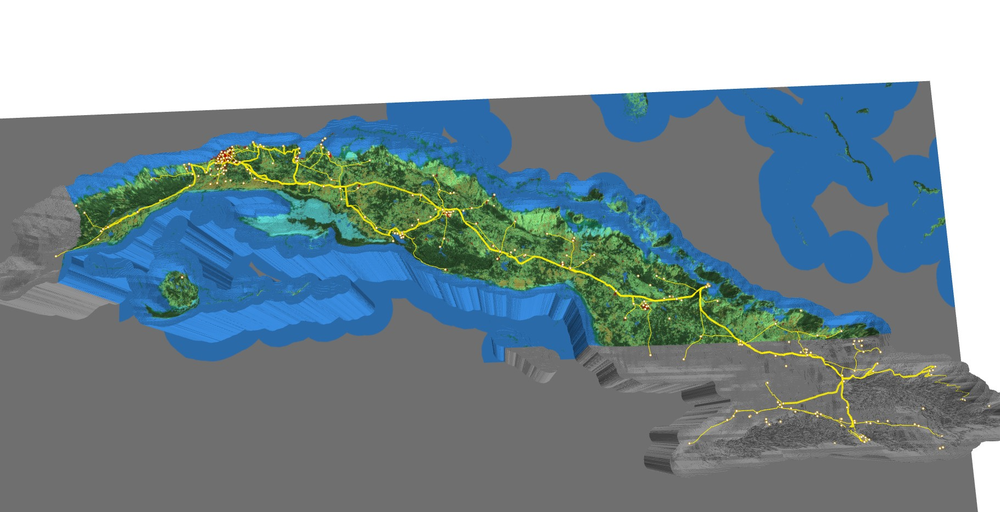

# ghi_grid_n_lancover_map
3D map of Cuba where elevation represents GHI values, color represents WorldCover classes, and has transmission line/substation overlay.

- Notebook: **cuba_renewable.ipynb**
- Current result: results/**cuba_solarHightMap_worldCoverColor_w_infra.html**